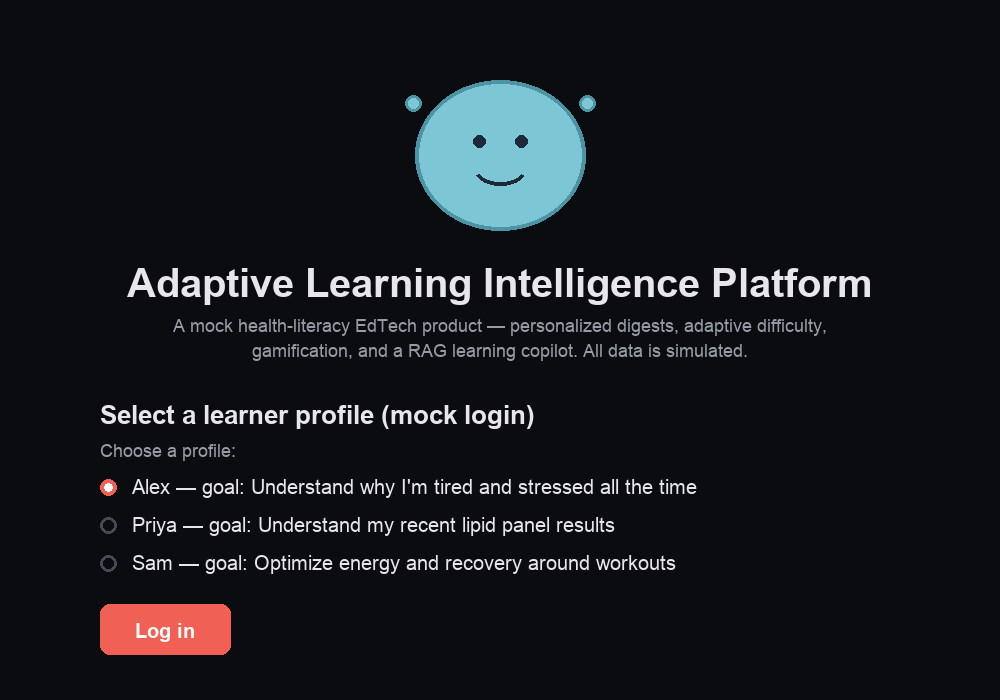

# Adaptive Learning Intelligence Platform

**A mock health-literacy EdTech product** — personalized digests, adaptive difficulty, gamification, a RAG-style learning copilot, and a mastery/engagement/completion measurement loop.

**[Live app →](https://adaptive-learning-intelligence-platform-5f4bsbxhgtdj44nchtp2q4.streamlit.app/)**

> **Note:** this runs on synthetic/mock data (3 sample learners, 10 sample health digests) — it's a working architecture demo, not a real course catalog or real user base. The RAG copilot uses simple keyword retrieval + templated responses, not a live LLM call.



---

## What This Demonstrates

Same measurement-loop pattern as [multi-judge-eval-framework](https://github.com/nainyM/multi-judge-eval-framework), applied to a consumer learning product instead of an internal eval pipeline:

| Piece | What it does |
|---|---|
| **Learner profiles** | Interests, goals, literacy level, progress — the "user table" (`data/learners.json`) |
| **Recommendation engine** (`src/recommend.py`) | Scores digests by tag overlap with interests + literacy-level match; transparent scoring, not a black box |
| **Adaptive difficulty** (`src/adaptive.py`) | Quiz performance shifts the learner's literacy level up or down automatically |
| **Gamification** (`src/gamification.py`) | Points, streaks, topic-completion badges |
| **Notifications** (`src/notifications.py`) | Mock notification log — streak reminders, new-content alerts, badge announcements (no real delivery channel connected) |
| **RAG learning copilot** (`src/copilot.py`) | Keyword-retrieval + templated answers grounded in the digest library, with a fixed health-literacy disclaimer on every response |
| **Measurement loop** (`src/measurement.py`) | Mastery (quiz accuracy), engagement (sessions/streaks), completion rate, recommendation effectiveness |

## Running It

```bash
pip install -r requirements.txt
cd app
streamlit run Home.py
```

Opens a multi-page app: **Home** (mock login — pick one of 3 sample learners) → **Home Feed** (recommendations) → **Digest Reader** (read + quiz, drives adaptive difficulty and points) → **Gamification** (streaks/badges/notifications) → **Copilot** (ask questions) → **Measurement Dashboard** (mastery/engagement/completion across all learners).

## Data

- `data/digests.json` — 10 mock health digests across Sleep Science, Nutrition, Cardiovascular Health, Stress & Mental Health, Movement & Exercise, and Gut Health, each with a difficulty level, tags, and a quick-check quiz question.
- `data/learners.json` — 3 mock learner profiles with different goals and literacy levels; acts as the persisted "database" for the demo (JSON file, not a real database — see design note below).

## Design Notes / Honest Limitations

- **No real database** — `data/learners.json` is read/written directly as the data store. Fine for a single-user demo; a real product would need an actual database (e.g., Postgres/Supabase) to handle concurrent users safely.
- **No real content generation or LLM calls** — digest content is hand-written mock data; the copilot's "generation" step is a template, not an LLM completion.
- **Guardrail built in from the start**: every copilot answer carries a fixed disclaimer that this is health-literacy education, not medical advice — a deliberate design choice given the sensitivity of health content, not an afterthought.
- **Notifications are logged, not delivered** — there's no email/push integration; the "Gamification" page just displays what would have been sent.

## What I'd Build Next

- Real content pipeline (structured health topics reviewed for accuracy, not hand-written mock digests)
- A real database instead of JSON file storage, to support concurrent multi-user access
- A true RAG pipeline (vector search over a larger content library + real LLM generation) instead of keyword-match + templates
- Real notification delivery (email/push) triggered by the same event logic already scaffolded in `notifications.py`
- A/B testing the recommendation engine's scoring weights against actual completion/mastery outcomes
